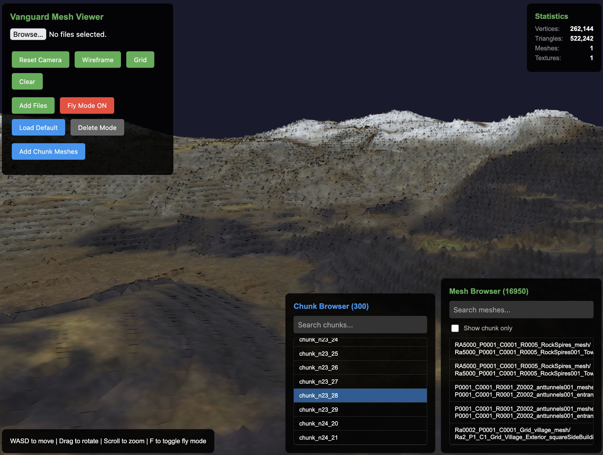
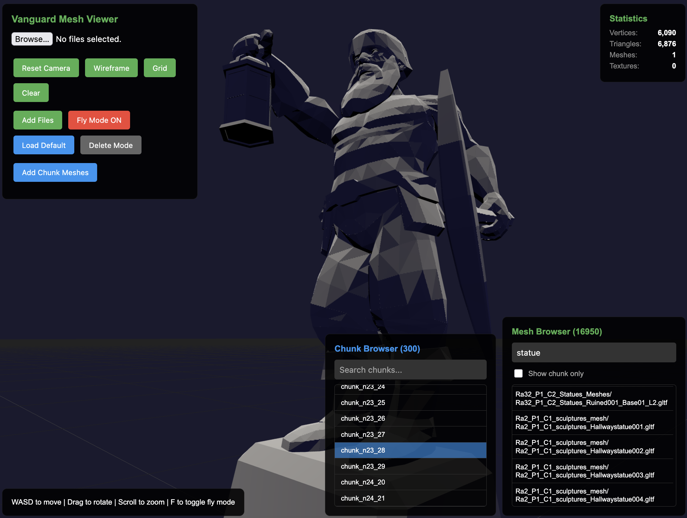

# Vanguard: Saga of Heroes Asset Extractor

Extracts and converts assets from the binary client files of Vanguard: Saga of Heroes, a 2007 MMORPG. This workspace contains the tools and specifications needed to extract 3D assets, terrain, and world data from the original game files (Unreal Engine 2.5) and render them in a modern WebGL environment.

This is still very much a work in progress. It is currently extracting many or most meshes from most binary files (including all the properties associated to them in UE2), extracting terrain for each chunk and applying the base color texture, and reconstructing data stored across many client files into a SQLite database. 

### Current issues:

* Terrain blending maps (grass/dirt/stone mix) are not yet implemented.
* Prefabs (collections of meshes) aren't yet positioning sub-elements properly in relation to each other
* Meshes within a chunk are not getting positioned relative to the chunk's origin properly
* Water volumes (BSPs) are not yet positioned properly in relation to terrain
* ~25% of meshes are getting extracted improperly and leading to garbage geometry
* ~20% of encoded binary data is not yet parsed correctly, perhaps in part becase Vanguard's use of UE2 differs from the source code available online. This is difficult and slow work due to UE2 being proprietary and there not being a lot of documentation available online and the nature of reverse engineering binary formats in the first place.

Anything that isn't basic geometry extraction for terrain, meshes, data, and objects is not yet implemented at all. We'd also want to eventually add support for things like particle effects, audio, lighting, textures, and many others.




---

## Documentation Index

To avoid repeating old mistakes or corrupting the data, every developer and AI agent should refer to these guides:

| Guide | Description |
|-------|-------------|
| **[DEVELOPER_GUIDELINES.md](./DEVELOPER_GUIDELINES.md)** | **Mandatory coding & documentation rules.** Defines the "Living Specification" requirement and "Docs First" policy. |
| **[UE2_GUIDE.md](./UE2_GUIDE.md)** | **Core UE2 Package Parser.** Documentation for reading `.usx`, `.vgr` headers, names, and exports natively in Python. |
| **[ENGINE_SOURCE_GUIDE.md](./ENGINE_SOURCE_GUIDE.md)** | **Reference Source Code.** How to use the 2007 UE2.5 source code to trace individual binary formats. |
| **[TERRAIN_GUIDE.md](./TERRAIN_GUIDE.md)** | **Living Specification**: VGR chunks, G16 heightmaps (swapped bytes), and DXT/RGBA terrain textures. |
| **[MESH_GUIDE.md](./MESH_GUIDE.md)** | **Living Specification**: StaticMesh (`.usx`) binary structures, LODModels, and format variants. |
| **[OBJECTS_GUIDE.md](./OBJECTS_GUIDE.md)** | **Living Specification**: World placements, CompoundObjects (prefabs), and scene "explosion" logic. |

---

## Quick Start

### 1. Configure Paths
Copy `config.example.py` to `config.py` and update the `ASSETS_PATH` to point to your Vanguard Assets directory:
```bash
cp config.example.py config.py
# Edit config.py with your paths
```

### 2. Initialize the Database
```bash
python3 setup.py
```
This will index all asset files, process chunk data, and extract property metadata for all objects.

**Flags:**
- `--reset` - Delete existing database and start fresh
- `--full` - Also run terrain and mesh extraction (may take much longer)

### 3. Start the Server
```bash
python3 server.py
```

### 4. View the Results
- **Mesh/World Viewer**: [http://localhost:8000/mesh_viewer/](http://localhost:8000/mesh_viewer/)
- **Data/Extractor Browser**: [http://localhost:8000/data_viewer/](http://localhost:8000/data_viewer/)

---

## Main Pipeline Components

### Extractors (`scripts/extractors/`)
- `extract_all_terrain.py`: **The main terrain engine.** Uses native Python to parse heightmaps and textures without umodel.
- `staticmesh_pipeline.py`: Pulls StaticMeshes from `.usx` packages into the glTF library.
- `extract_chunk_data.py`: Populates the database with object placements from VGR files.
- `extract_properties.py`: **Universal property crawler.** Parses every class member (Location, Scale, Mesh references) into the database.
- `index_meshes.py`: Builds the mesh_index table mapping mesh names to packages.

### Generators (`scripts/generators/`)
- `generate_objects_scene.py`: Reconstructs local chunk scenes by "exploding" prefabs and placing meshes in world space.

### Core Libraries (`ue2/` & `scripts/lib/`)
- `ue2/package.py`: The foundation. Parses UE2 package headers, name tables, and exports.
- `scripts/lib/staticmesh_construct.py`: The binary definition of a Vanguard mesh section.

---

## Viewers

| Viewer | Path | Purpose |
|-------|------|---------|
| **Data Viewer** | `data_viewer/` | Browse the SQLite database, view export properties, and run extractors. |
| **Mesh/World Viewer** | `mesh_viewer/` | Modern 3D viewer for browsing exported meshes and reconstructed chunk scenes. |
| **Legacy Viewer** | `_archive/vanguard_viewer.html` | (Archived) Original standalone drag-and-drop glTF viewer. |

---

## Data Topology

- **`output/data/`**: The canonical SQLite database (`vanguard_data.db`).
- **`output/terrain/`**: Extracted terrain meshes (300+ chunks).
- **`output/meshes/`**: The library of exported building and environmental assets (2800+ models).

---
